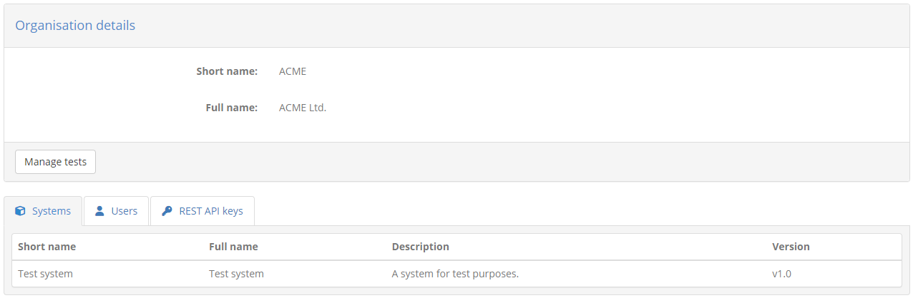
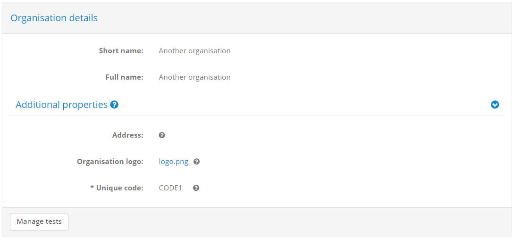
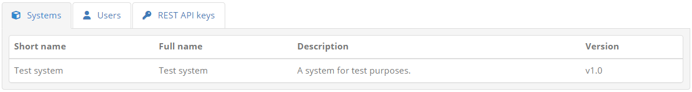
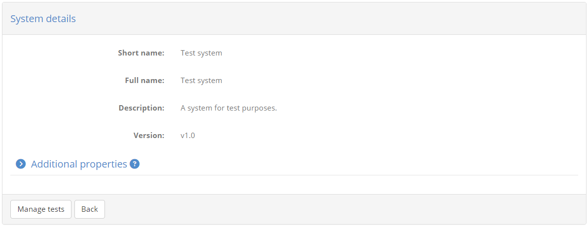
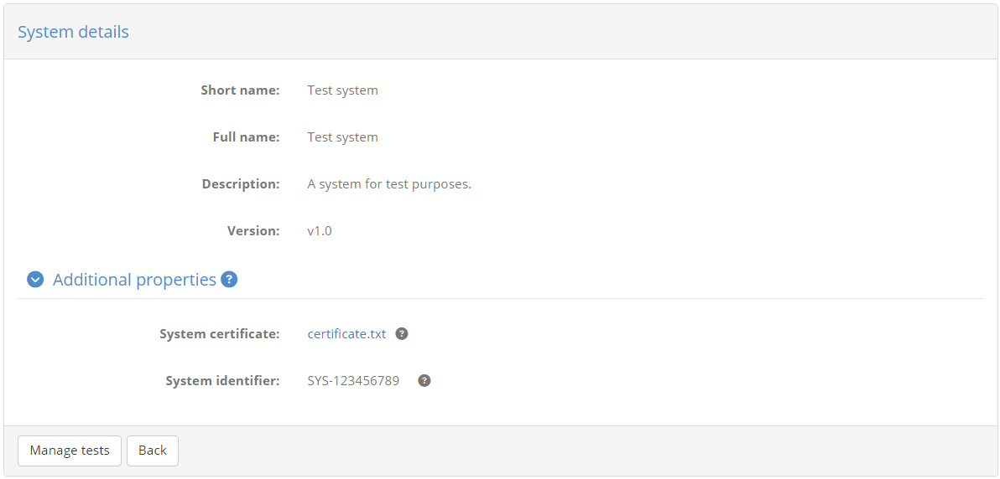
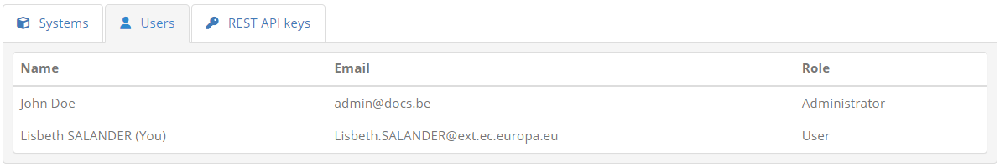
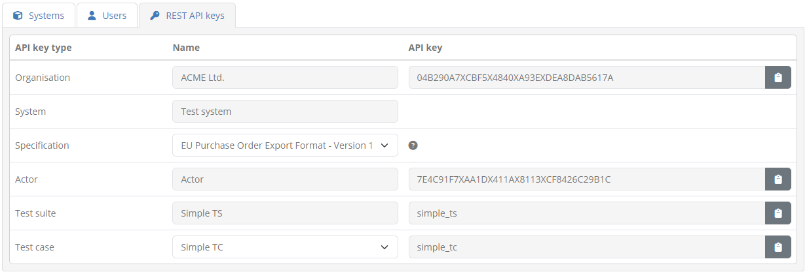

.. _manage_organisation:

Manage your organisation
========================

To view your organisation's information click the **My organisation** link from the side menu. The screen you 
are presented with shows you the information relevant to your organisation, split in the following sections:

* **Organisation details:** The name (short and full) of your organisation.
* **Systems**: A tab listing the systems defined for your organisation.
* **Users:** A tab listing your organisation's users. This includes yourself as well as any other 
  users configured by administrators. For each user the **name**, **username** (or **email** if using EU Login) and **role** are presented.
* **REST API keys:** A tab, visible if :ref:`testing via REST API<execute_tests_rest>` is enabled by your administrator, allowing you to view and manage the
  keys you need to use it.

If your community administrator has defined additional properties for its organisations you will also see here an
**Additional properties** section that you can click to display your organisation's additional information. 

If this is expanded you will see a list of these additional properties along with their currently configured values.
Such properties can be simple texts, secret values (e.g. passwords) or files and, if supplied by your community 
administrator, will display a help tooltip to understand their meaning. Only administrators may update these properties
but you can view their configured values or download their linked files. Required properties are marked with an asterisk
and will need to be completed by an administrator before your organisation can engage in any tests.

From this point you can review your organisation's :ref:`systems <manage_organisation__systems>`, :ref:`users <manage_organisation__users>`
and :ref:`REST API keys <manage_organisation__rest>` by clicking on their respective tabs. You may also click the **Manage tests** 
button to view your organisation's :ref:`conformance statements <manage_your_conformance_statements>`.

.. _manage_organisation__systems:

Manage your systems
-------------------

Selecting the **Systems** tab presents the :ref:`systems <introduction__glossary__system>` defined for your organisation.
Systems are an important concept in the test bed as they represent the software components you are testing for. Before
proceeding to test anything you will need to have one or more systems that you can use to define conformance statements.

Your organisation's systems are presented in a table that displays for each system:

* Its **short name**, a brief name used to display in search results.
* Its **full name**, the complete system name presented in reports and detail screens.
* A **description**, providing additional context on the specific system.
* A **version** number.

To view the details of a specific system you can click its row in the table. Doing so will present you with its detail page
where you can see the **short** and **full name** of the system, its **description** and its **version** number.

From this screen you can click the **Back** button to return to your :ref:`organisation's details <manage_organisation>`,
or on the **Manage tests** button to view the system's :ref:`conformance statements <manage_your_conformance_statements>`.

If your community administrator has foreseen additional properties for systems you will also see here the **Additional properties** section.
Clicking this will expand to also display the current system's additional information.

The displayed properties can be simple texts, secret values (e.g. passwords) or files and, if supplied by your community 
administrator, will display a help tooltip to understand their meaning. Only administrators may update these properties
but you can view their configured values or download their linked files. Required properties are marked with an asterisk
and will need to be completed by an administrator before launching any tests for this system.

.. note::
    **Editing a system's information:** The information displayed on this screen is read-only. Editing the system's information is reserved 
    to your administrator.

.. _manage_organisation__users:

Manage your users
-----------------

Selecting the **Users** tab presents your organisation's users. This includes yourself as well as any other
users defined by administrators.

Each user is displayed in a row presenting her **name**, **email** and **role**. Your entry in the table is
highlighted with a "(You)" displayed at the end of your name.

.. _manage_organisation__rest:

Manage your REST API keys
-------------------------

Selecting the **REST API keys** tab (if available) presents you the API keys to :ref:`launch and manage test sessions via REST API<execute_tests_rest>`. This tab
may be missing if use of this REST API is not enabled by your administrator.

From this table you can view and copy the keys you need to identify your organisation, the system to be tested and the target conformance statement and
tests. These API keys are listed in a table presenting per case the key to consider. For each key you may click the provided **copy** control to copy it to your
clipboard.

The keys listed include the following:

* **Organisation:** The key to identify your organisation. The readonly name of the organisation is displayed alongside the key.
* **System:** The key to identify a specific system. If your organisation defines multiple systems these are presented in a dropdown list and selecting one
  will display its API key.
* **Specification:** The target specification does not itself define an API key but you need to select one to view the API keys of its related information
  (actors, test suites and test cases). If you have conformance statements for only a single specification this appears as preselected and readonly.
* **Actor:** The key to identify the target specification's actor. The actor, along with your selected system essentially constitute your target
  :ref:`conformance statement<manage_your_conformance_statements>`. The selected specification's actors are listed in a dropdown list unless there is a single one which would appear as a readonly preset selection.
  Selecting an actor from the list displays its related API key.
* **Test suite:** The key to identify a specific test suite. Selecting a given test suite displays its relevant API key.
* **Test case:** The key to identify a specific test case within the selected test suite. Selecting a given test case displays its relevant API key.

The organisation and system API keys are managed by your organisation's administrator and may be missing if they have never been initialised. On the other hand, the keys relevant 
to specifications, actors, test suites and test cases will always be available.

Details on how these REST API keys are used to launch and manage test sessions are provided in :ref:`execute_tests_rest`.

.. note::

  The displayed specifications, actors, test suites and test cases are limited to those linked to your already configured :ref:`conformance statements<manage_your_conformance_statements>`.